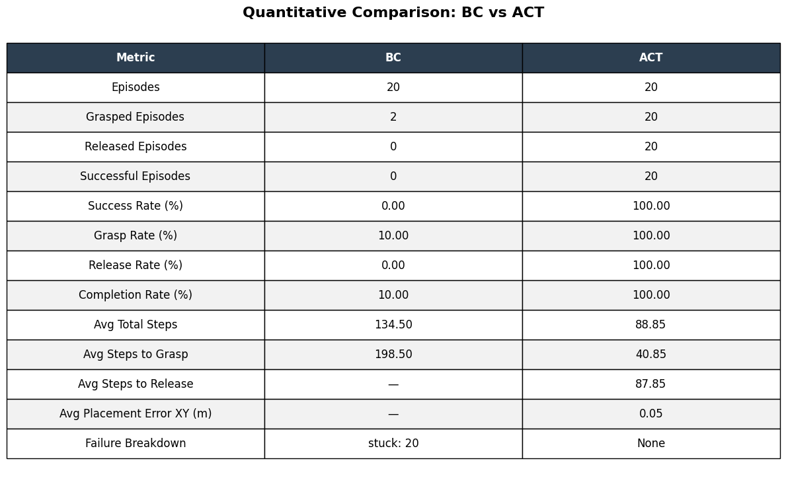
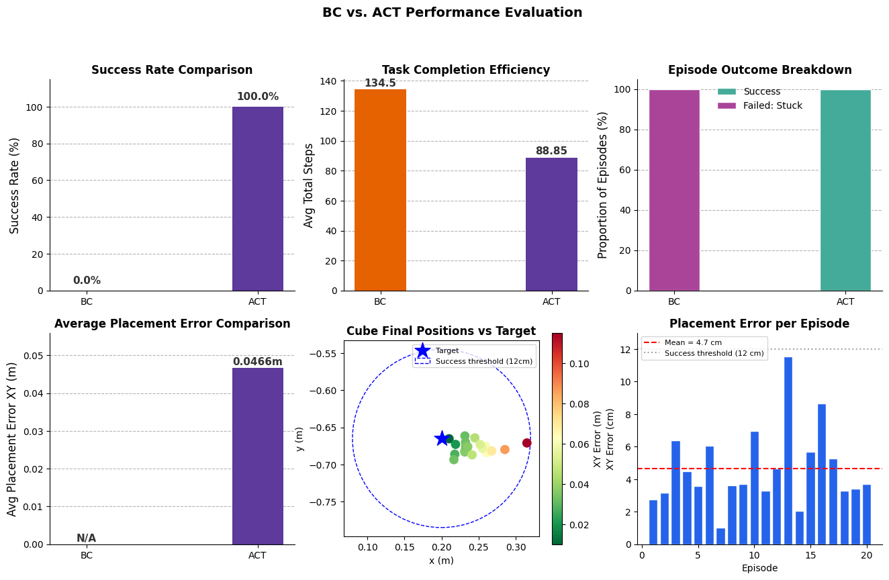
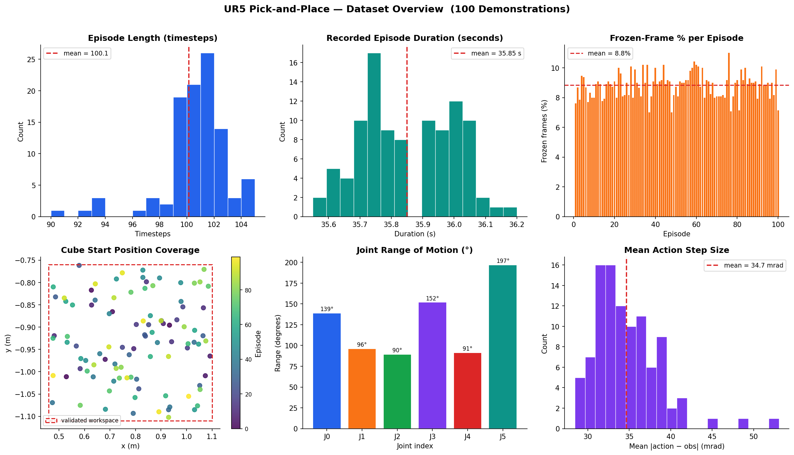
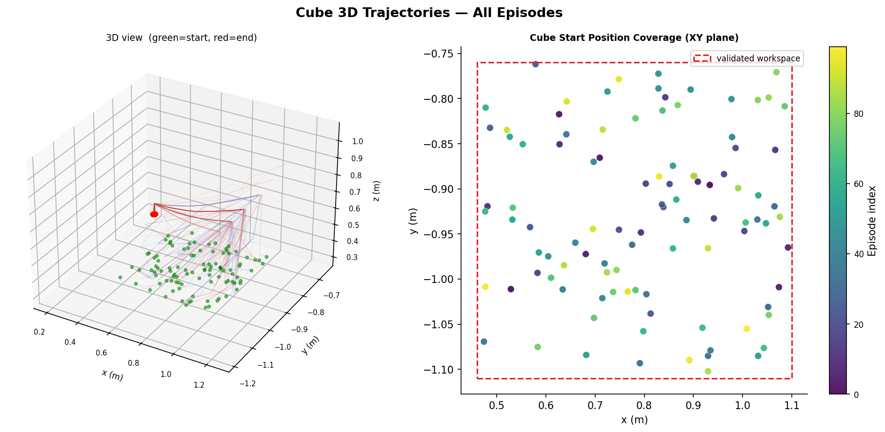
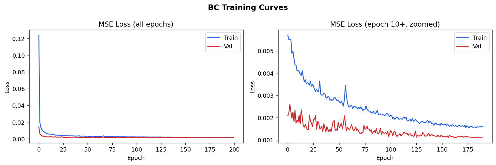
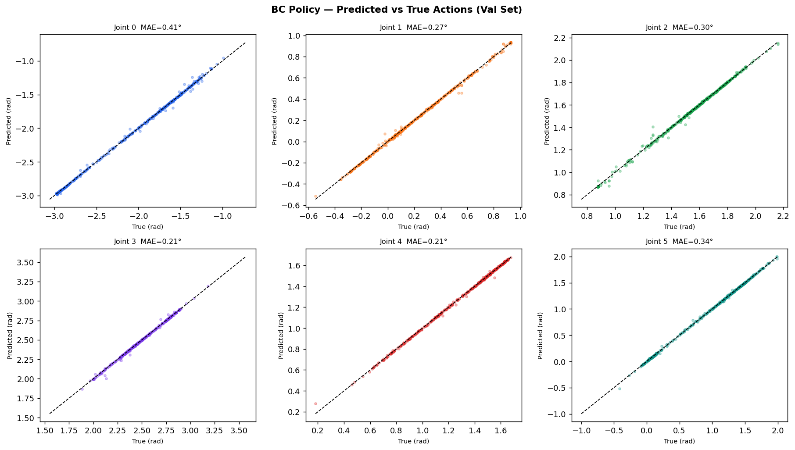
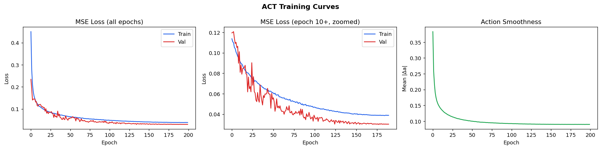
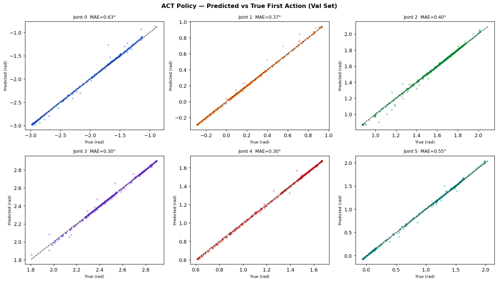
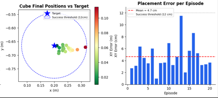
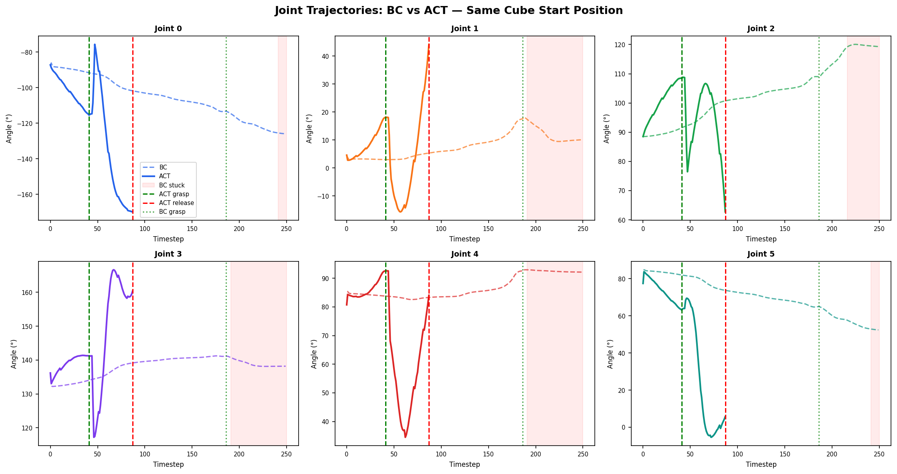

# Imitation Learning for Robotic Pick-and-Place: Behavioural Cloning vs Action Chunking Transformers

[](https://python.org)
[](https://pytorch.org)
[](https://www.coppeliarobotics.com)
[](LICENSE)

---

## Abstract

This project investigates a fundamental question in robot imitation learning: can a policy trained offline on expert demonstrations reliably execute sequential manipulation tasks in closed-loop? I empirically compare Behavioural Cloning (BC) and Action Chunking with Transformers (ACT) on a randomised pick-and-place task using a UR5 arm in CoppeliaSim. Despite BC achieving low offline validation loss (MSE ≈ 0.001), it fails entirely in deployment due to covariate shift and compounding sequential errors - all 20 evaluation episodes terminate due to trajectory stagnation. ACT achieves 100% task success across 20 identical episodes with a mean placement error of 4.66 cm, validating the importance of temporal action modelling for robotic manipulation.

---

## Highlights

- **100% vs 0%**: ACT achieves perfect task completion; BC fails on every episode even with strong offline metrics
- **Action chunking matters**: predicting 10-step trajectories instead of single actions eliminates the feedback collapse that stalls BC
- **Teacher forcing gap confirmed**: BC val MSE 0.001 did not translate to any closed-loop success, a concrete demonstration of the offline-to-deployment gap
- **Failure analysis**: four distinct BC failure modes documented with root cause analysis (covariate shift, mean-action averaging, temporal instability, state distribution mismatch)
- **Full pipeline**: automated expert data collection → HDF5 dataset → offline training → closed-loop evaluation, all instrumented and reproducible

---

## Demo
### Representative Rollout Comparison: BC vs ACT
<video src="assets/bc_vs_act_side_by_side_comparison.mp4" autoplay loop muted playsinline style="max-width: 100%;"></video>

> Three representative evaluation episodes illustrating common Behavioral Cloning failure modes and the corresponding ACT rollouts under identical initial cube configurations.

### BC/ACT Full Rollout
| BC Policy — 0% Success | ACT Policy — 100% Success |
|:---:|:---:|
|  |  |

> 20 episodes each, identical cube start positions, same evaluation protocol.

---

## Results Summary




---

<details>
<summary><b>Repository Structure</b></summary>
<pre>
ur5-imitation-learning/
│
├── README.md                               # Project overview, methodology, and results
├── requirements.txt                        # Python dependencies
│
├── simulation/
│   ├── coppeliasim_scene/
│   │   └── ur5_imitation_learning.ttt      # UR5 pick-and-place simulation environment
│   │
│   └── coppeliasim_scripts/
│       ├── UR5_script.lua                  # Expert pick-and-place controller
│       └── barrettHand_script.lua          # BarrettHand grasp/release logic
│
├── scripts/
│   ├── main.py                             # Automated expert demonstration collection pipeline
│   │
│   └── utils/
│       ├── pick_and_place_imitation_data_recorder_utils.py
│       │                                  # HDF5 trajectory recording utilities
│       ├── randomize_cube_position_utils.py
│       │                                  # Cube pose randomization for dataset generation
│       └── zmq_remoteapi_connection_utils.py
│                                          # CoppeliaSim Remote API connection utilities
│
├── training/
│   ├── bc_training.ipynb                   # Behavioral Cloning (MLP) training pipeline
│   └── act_training.ipynb                  # Action Chunking Transformer training pipeline
│
├── inference/
│   ├── bc_inference.py                     # Closed-loop BC policy evaluation
│   ├── act_inference.py                    # Closed-loop ACT policy evaluation
│   ├── bc_trajectory_recorder.py           # Records BC rollout trajectories for analysis
│   └── act_trajectory_recorder.py          # Records ACT rollout trajectories for analysis
│
├── analysis/
│   ├── dataset_analysis.py                 # Dataset statistics and visualization generation
│   ├── bc_vs_act_trajectory.py             # Joint trajectory comparison between BC and ACT
│   └── act_vs_bc_quantitative_comparison.py
│                                          # Evaluation metrics and performance comparison plots
│
├── data/
│   └── README.md                           # Dataset schema, observation format, and trajectory structure
│
├── pick_and_place_imitation_data/
│   └── *.hdf5                              # 100 expert demonstration trajectories
│
├── checkpoints/
│   ├── bc_checkpoints/
│   │   ├── bc_best.pth                     # Best Behavioral Cloning model
│   │   └── *.npy                           # Observation/action normalization statistics
│   │
│   └── act_checkpoints/
│       ├── act_best.pth                    # Best ACT model
│       └── *.npy                           # Observation/action normalization statistics
│
├── results/
│   ├── bc_eval_results.json                # BC rollout evaluation metrics
│   ├── act_eval_results.json               # ACT rollout evaluation metrics
│   ├── bc_traj_episode.json                # Example BC rollout trajectory
│   └── act_traj_episode.json               # Example ACT rollout trajectory
│
└── assets/
    │
    ├── dataset_assets/
    │   ├── fig1_dataset_overview.png       # Demonstration dataset statistics
    │   ├── fig2_trajectory_summary.png     # Expert trajectory analysis
    │   └── fig3_cube_trajectories.png      # Cube position distribution
    │
    ├── bc_assets/
    │   ├── bc_training_curves.png          # BC training/validation loss
    │   └── bc_pred_vs_true.png             # BC prediction vs expert actions
    │
    ├── act_assets/
    │   ├── act_training_curves.png         # ACT training/validation loss
    │   ├── act_pred_vs_true.png            # ACT prediction vs expert actions
    │   └── act_placement_accuracy.png      # ACT placement accuracy analysis
    │
    ├── comparison_plots/
    │   ├── act_vs_bc_quantitative_comparison_table.png
    │   │                                  # Quantitative evaluation summary
    │   ├── act_vs_bc_comparison_plots.png
    │   │                                  # Success rate, efficiency, and placement comparison
    │   └── bc_vs_act_joint_trajectory.png
    │                                      # Joint trajectory and smoothness comparison
    │
    ├── bc_rollout.gif                      # Representative BC deployment rollout
    ├── act_rollout.gif                     # Representative ACT deployment rollout
    └── bc_vs_act_side_by_side_comparison.mp4
                                           # Direct BC vs ACT rollout comparison
</pre>
</details>

---

## Setup

```bash
git clone https://github.com/sunday-ikechukwu/ur5-imitation-learning.git
cd ur5-imitation-learning
pip install -r requirements.txt
```

**Requirements:**
```
coppeliasim-zmqremoteapi-client
numpy
h5py
torch==2.3.0
matplotlib
```

CoppeliaSim must be running with the ZMQ Remote API enabled before executing any script. The UR5 + BarrettHand scene file should be open in CoppeliaSim.

---

## Method

### Task

The robot must pick a cube from a randomised position on a pick table and transport it to a fixed place table. Cube start positions are sampled uniformly from a validated reachable workspace at the start of each episode:

```
x ~ Uniform(0.46, 1.10) m
y ~ Uniform(-1.11, -0.76) m
z = 0.38 m  (fixed — table surface)
```

### Observation and Action Space

```
Observation (17-dim):
  joint_positions      6   UR5 joint angles (rad)
  end_effector_pose    7   EE position (3) + quaternion (4)
  cube_position        3   cube XYZ in world frame (m)
  gripper_state        1   BarrettHand finger joint value

Action (6-dim):
  target joint angles      next arm configuration (rad)
```

### Grasp Emulation

The BarrettHand does not use contact-based physics grasping. Following the expert Lua controller, grasping is implemented via `sim.setObjectParent()` — the cube is parented to the gripper attach point when the end-effector enters a proximity threshold. This deterministic grasp design isolates arm trajectory learning from unstable contact physics, focusing the learning problem on motion planning.

### Expert Demonstrations

100 demonstrations were collected automatically using a Lua IK-based expert policy inside CoppeliaSim. The expert generates a full pick-and-place path using inverse kinematics (`simIK`) before each episode, executes it step-by-step, and signals completion via an integer flag (`pick_and_place_done`). Python polls this flag via the ZMQ Remote API while recording observations and actions at each timestep.

---

## Dataset




| Property | Value |
|---|---|
| Episodes | 100 |
| Effective sampling rate | ~3 Hz |
| Mean episode length | 100.1 ± 2.5 timesteps |
| Total timesteps | 10,014 |
| Gripper transitions / episode | 2.0 (all complete) |
| Cube x coverage | [0.46, 1.10] m |
| Cube y coverage | [-1.11, -0.76] m |

> **Note on sampling rate:** The intended rate was 20 Hz (50 ms sleep), but effective throughput was ~3 Hz due to ZMQ Remote API round-trip overhead (~9 calls per observation). This is consistent across both recording and inference, so training and deployment dynamics match.

See [data/README.md](data/README.md) for the full dataset schema, HDF5 structure, and per-field documentation.

---

## Training

Both models were trained on Google Colab (T4 GPU). Training data was split episode-level (90/10) to ensure the validation set contains genuinely unseen trajectories.

### Behaviour Cloning

A 3-layer MLP with LayerNorm and Dropout trained via MSE regression to predict the next joint configuration from the current observation.

```
Architecture: Linear(17→256) → LayerNorm → ReLU → Dropout(0.1)
            → Linear(256→256) → LayerNorm → ReLU → Dropout(0.1)
            → Linear(256→128) → LayerNorm → ReLU
            → Linear(128→6)

Optimiser: Adam  LR=1e-3  weight_decay=1e-5
Scheduler: CosineAnnealingLR  T_max=200
Epochs:    200   Batch size: 256
```



| Metric | Value |
|---|---|
| Best val loss (MSE) | 0.001092 |
| Best epoch | 173 / 200 |
| Overall MAE (val) | **0.29°** across all 6 joints |



### ACT — Action Chunking with Transformers

A state-only encoder-decoder transformer trained to predict a **chunk of 10 future actions** simultaneously. At inference, actions are executed from a buffer. The policy is only re-queried once the buffer is empty, reducing the frequency of potentially error-compounding policy calls.

```
Architecture: Encoder — TransformerEncoder (4 layers, 8 heads, d_model=256)
              Decoder — TransformerDecoder (4 layers, 8 heads, d_model=256)
              Action queries — learned embeddings (chunk_size=10)
              Action head — Linear(256→6)

Loss: SmoothL1 + 0.01 × action smoothness regularisation
Optimiser: AdamW  LR=1e-4  weight_decay=1e-4
Scheduler: CosineAnnealingLR  T_max=200
Epochs:    200   Batch size: 64
```

The smoothness regularisation term penalises large consecutive action differences within a chunk, encouraging the policy to predict physically coherent trajectories:

```python
smoothness_loss = (pred[:, 1:] - pred[:, :-1]).abs().mean()
loss = task_loss + 0.01 * smoothness_loss
```



| Metric | Value |
|---|---|
| Best val loss (SmoothL1) | 0.029922 |
| Best epoch | 188 / 200 |
| Overall MAE — first action (val) | **0.43°** |
| Chunk size | 10 |



> ACT's higher per-step MAE relative to BC is expected and does not indicate inferior learning. BC's val set contains random timesteps from seen episode types; ACT's val set contains complete unseen episodes (episode-level split). ACT's sequential execution advantage is reflected in closed-loop performance, not single-step prediction error.

---

## Evaluation

Both policies were evaluated on 20 episodes with **identical cube start positions** for a controlled comparison. The expert Lua controller was disabled; each policy controlled all 6 UR5 joints directly via `sim.setJointTargetPosition()`. Grasp and release were triggered by position-based proximity thresholds mirroring the expert Lua controller logic.

Each episode was instrumented to record:
- `steps_to_grasp` — timestep at which grasp trigger fired
- `steps_to_release` — timestep at which release trigger fired
- `placement_error_xy` — XY distance between cube final position and place pose
- `failure_reason` — categorised failure mode for failed episodes

```bash
python inference/bc_inference.py  --n_episodes 20 \
                                   --checkpoint ../checkpoints/bc_checkpoints/bc_best.pth \
                                   --stats_dir  ../checkpoints/bc_checkpoints/

python inference/act_inference.py --n_episodes 20 \
                                   --checkpoint ../checkpoints/act_checkpoints/act_best.pth \
                                   --stats_dir  ../checkpoints/act_checkpoints/
```

---

## Results

### Quantitative Comparison

ACT achieved **100% task success across all 20 episodes**. BC achieved **0% success**, with every episode terminating due to trajectory stagnation detected by a rolling EE displacement monitor (< 5 mm over 50 steps).

The grasp rate disparity (10% BC vs 100% ACT) and the step efficiency gap (198.5 steps to grasp for BC vs 40.85 for ACT) quantify the severity of BC's sequential execution failure.

### ACT Placement Accuracy



ACT placed the cube within a mean XY error of 4.66 cm from the target across all 20 episodes. All placements landed on the place table (z = 0.30 m). The worst-case placement error was 11.5 cm (episode 13), still within the 12 cm success threshold.

### Joint Trajectory Analysis



The trajectory comparison on the same cube start position reveals the fundamental difference in execution profiles:

**ACT** executes a decisive multi-phase trajectory. Each joint moves purposefully through approach, descent, grasp (step ~42), lift, transport, and release (step ~88). The green and red vertical markers confirm task completion within 88 steps.

**BC** drifts slowly toward the pick region over ~185 steps, eventually triggering a grasp, then immediately stalls. The red shading marks the onset of trajectory stagnation. BC grasps but cannot continue to the place pose. The contrast in step count alone (42 vs 185 steps to grasp) illustrates how action chunking enables decisiveness that frame-wise prediction cannot achieve.

---

## BC Failure Analysis

<details>
<summary>Click to expand — detailed BC failure mode documentation</summary>

### Failure Type A — Freeze at Pick Pose

**Observed behaviour:** The arm successfully approached the cube and aligned with the grasp region but stopped moving afterward, hovering above the cube indefinitely.

**Root cause:** Covariate shift. The policy could navigate to the approximate pick region but entered states not present in training once it reached close proximity. Prediction quality degraded, producing near-zero action deltas that caused the arm to stall.

---

### Failure Type B — Grasp Without Lift

**Observed behaviour:** The grasp trigger fired — the cube was attached to the gripper, but the arm moved laterally at table height rather than lifting, dragging the cube across the surface toward the place pose and away from it in another sceneario.

**Root cause:** Unstable post-grasp trajectory prediction. The policy captured the approach motion but failed to reproduce the lift phase, likely because post-grasp states with an attached cube differed from training states where the cube was still on the table.

---

### Failure Type C — Slow Convergence / Timeout

**Observed behaviour:** The arm moved very slowly toward the cube in small incremental steps, never completing the task within the episode horizon.

**Root cause:** Action magnitude collapse. The policy averaged across nearby training trajectories with different approach angles, producing conservative low-magnitude outputs rather than committing to a single path. Mean episode steps for BC: 134.5 — still incomplete.

---

### Failure Type D — Home Pose Collapse

**Observed behaviour:** Some episodes showed minimal movement from the initial arm configuration, with the arm remaining near its home pose for the full episode.

**Root cause:** Regression to mean actions. The home pose configuration represented a low-density region of the training state distribution, the policy predicted the statistical average of all trajectories from that start state, which approximated no motion.

---

### The Teacher Forcing Gap

BC training uses teacher forcing at each training step, the correct expert observation is provided as input. At inference, the model must act on its own previous outputs. Once a small error accumulates, the model enters states it never saw during training, and prediction quality degrades non-linearly. This gap between training and deployment is the root cause of all four failure modes above.

BC val MSE: **0.001** — strong by supervised learning standards.
BC closed-loop success: **0%** — complete deployment failure.

This disconnect is one of the most important empirical findings of this project.

</details>

---

## Key Findings

**1. Low offline validation loss does not guarantee closed-loop success.**
BC's val MSE of 0.001 which by supervised learning standards is well-optimised, translated to 0% task success in deployment. This is a concrete demonstration of the teacher forcing gap: offline training provides correct expert states at every step; deployment requires the policy to act on its own imperfect history.

**2. Action chunking resolves the feedback collapse that stalls frame-wise policies.**
By predicting and committing to 10-step trajectories before re-querying, ACT reduces the frequency of potentially error-compounding policy calls. BC re-queries every step, each query on a slightly degraded observation compounds the error. ACT re-queries every 10 steps, substantially dampening error accumulation.

**3. Sparse coverage degrades BC more than ACT.**
100 demonstrations across a fully randomised workspace meant each state region was visited rarely. BC's MLP averaged across all nearby trajectories rather than committing to any, producing the hesitant low-magnitude motion observed across all failure modes. ACT's transformer architecture handles this more gracefully by modelling temporal structure rather than point-wise mappings.

**4. Partial competence is scientifically informative even without task success.**
BC demonstrated consistent spatial awareness; orienting toward the cube, approaching the pick region, and occasionally triggering grasps. This confirms the policy learned coarse spatial mappings. The failure is in temporal chaining, not spatial understanding.

---

## Engineering Challenges

Real robotics systems engineering involves debugging that does not appear in tutorial implementations. Key challenges encountered and resolved during this project:

**PyTorch DataLoader I/O bottleneck.** Initial ACT training epochs took over 30 minutes per epoch despite the relatively small dataset. Profiling revealed that the Dataset implementation performed file reads during every `__getitem__()` call to construct action chunks, resulting in ~90,000 disk I/O operations per epoch. The bottleneck was amplified by DataLoader multiprocessing (`num_workers=2`), where worker processes spent most of their time waiting on filesystem access rather than preparing batches. The data pipeline was redesigned as an `InMemoryACTDataset` that preloads all HDF5 trajectories into RAM as contiguous PyTorch tensors. By constructing chunks directly from memory and eliminating unnecessary worker overhead (`num_workers=0`), epoch times were reduced from tens of minutes to seconds

**ZMQ Remote API thread safety.** An initial implementation attempted to run sensor polling in a background thread while the main thread managed the simulation loop. The ZMQ socket underlying the CoppeliaSim remote API is not thread-safe, thus concurrent calls produced `ZMQError: Operation cannot be accomplished in current state`. The architecture was redesigned to a single-thread polling loop.

**Effective sampling rate mismatch.** The data collection loop used `time.sleep(0.05)` targeting 20 Hz. In practice, each observation required ~9 ZMQ calls (6 joint reads + EE pose + cube position + gripper), producing an effective rate of ~3 Hz. This was identified post-collection through timing analysis and documented in [!DATA README.md](data/README.md) Crucially, inference runs at the same ~3 Hz rate, so training and deployment dynamics are consistent.

**Joint control mode.** Initial inference attempts using `sim.setJointPosition()` produced no motion on some episodes. Investigation revealed that `sim.setJointTargetPosition()` with the physics engine active was required for consistent motion. The distinction between direct position setting (bypasses physics) and target position setting (respects joint dynamics) is non-trivial and affected rollout behaviour.

**Handle ordering mismatch.** A `get_handles()` function returning 4 values was unpacked into 7 variables at the call site, causing a `TypeError` that was non-obvious because the handles were defined in a different module. Standardising handle definitions across inference scripts resolved this.

**Inference normalisation.** Observation normalisation statistics (mean, std) computed on the training split must be applied identically at inference. Missing this step causes the policy to receive out-of-distribution inputs and produce garbage actions. Statistics were saved as `.npy` files during training and loaded explicitly at inference.

**Duplicate print loop.** A debug print statement inside the joint-setting `for` loop fired 6 times per step (once per joint), creating the false impression of very slow control frequency. The loop structure was corrected once identified via timing analysis.

---

## Limitations and Future Work

**Temporal fidelity.** Using `sim.setStepping(True)` with synchronised stepping would yield one recorded sample per simulation step, eliminating the ZMQ overhead timing uncertainty and producing higher-fidelity demonstrations.

**Dataset coverage.** Structured demonstration coverage -  for example, 20 fixed positions × 5 demonstrations each = 100 demos with denser per-region coverage would likely improve BC significantly by reducing the averaging effect from sparse trajectories.

**Algorithm extensions.** Natural next steps include Diffusion Policy (stronger multimodal distribution modelling), recurrent BC with LSTM (explicit temporal memory), and dataset aggregation via DAgger (online correction of covariate shift).

**Generalisation evaluation.** Current evaluation uses the same workspace distribution as training. Evaluating on held-out positions outside the training range would directly measure generalisation rather than in-distribution robustness.

---

## References

- Zhao, T. Z., et al. (2023). *Learning Fine-Grained Bimanual Manipulation with Low-Cost Hardware.* RSS 2023. [[arXiv]](https://arxiv.org/abs/2304.13705)
- Hussein, A., et al. (2017). *Imitation Learning: A Survey of Learning Methods.* ACM Computing Surveys.
- Pomerleau, D. (1989). *ALVINN: An Autonomous Land Vehicle in a Neural Network.* NeurIPS.
- Ross, S., Gordon, G., & Bagnell, D. (2011). *A Reduction of Imitation Learning and Structured Prediction to No-Regret Online Learning.* AISTATS. *(DAgger)*
- Chi, C., et al. (2023). *Diffusion Policy: Visuomotor Policy Learning via Action Diffusion.* RSS 2023.
- LeRobot — Hugging Face. [[repo]](https://github.com/huggingface/lerobot)

---

## Citation

```bibtex
@misc{sunday2026ur5imitation,
  author    = {Sunday Ikechukwu},
  title     = {Imitation Learning for Robotic Pick-and-Place: Behavioural Cloning vs Action Chunking Transformers},
  year      = {2026},
  publisher = {GitHub},
  url       = {https://github.com/sunday-ikechukwu/ur5-imitation-learning}
}
```